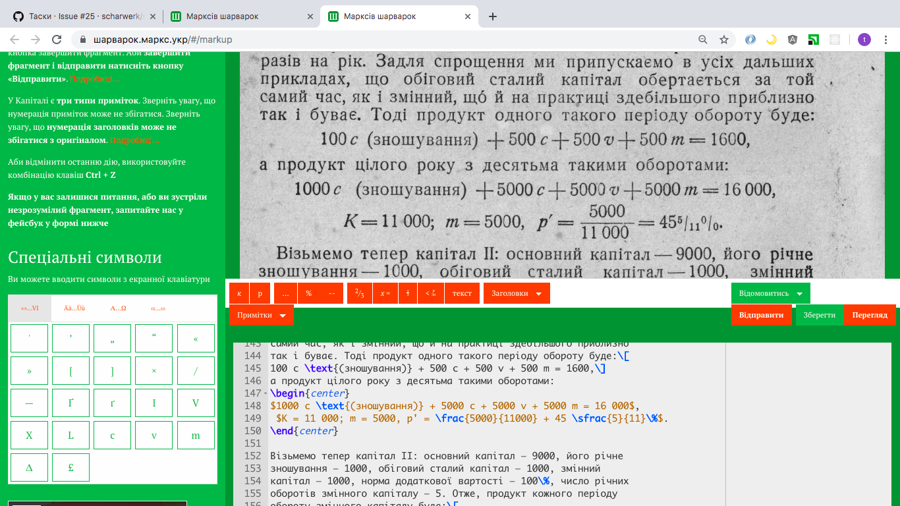
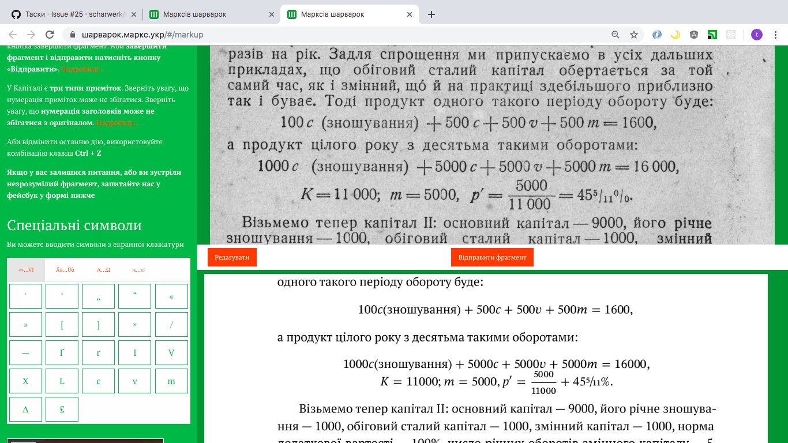

# Das Scharwerk



## About the project

Das Scharwerk is distributed publishing system.

Book digitization workflow::

1. Set up. Admin load book screenshots and raw scanned text.
2. Proof reading. On this stage, users compare text in editor with scans.
3. Latex markup. The text editor contain basic latex commands, for more specific tasks like tables use pure latex.



## Technical background of the project

* Rails for backend and Angular 1 for frontend
* We use github as text storage, and version control system
* Login via Facebook only
* For background processing we use Sidekiq(it commits texts to github asynchronously)

## How to start local

1. Install rails http://railsapps.github.io/installing-rails.html
2. Install deps

    bundler install

3. Run and go to http://localhost:3000/

    rails s

## Codestyle

Please, before push to github run in console, in your project folder:

    rubocop

## test

    bundle exec rspec

## migration

    rake db:migrate RAILS_ENV=test

## Deployment

If assets changed:

    RAILS_ENV=production rake assets:clobber
    RAILS_ENV=production rake assets:precompile

Connect via ssh:

    ssh root@46.101.228.108

Go to the project folder:

    cd /home/rails/scharwerk

Config sidekiq. Copy upstart/sidekiq.conf to /etc/init/sidekiq.conf. Set the PASSWORD_GOES_HERE
in file. Start by:

    start sidekiq index=0
    sudo service sidekiq restart index=0

Run Latex docker from root!

Logs in /var/log/upstart/sidekiq-0.log

Get new version:

    git pull

Update project:

    bundle install --deployment --without development test
    . /etc/default/unicorn
    RAILS_ENV=production rake db:migrate

If styling changed:

    service unicorn restart
    service nginx reload

Visit http://46.101.228.108/

## Tex processing

How to use tex processing tools.
1. Add method into lib/tasks/tex_processing.rb, it is plain old ruby not a rake task

2. Run the task from console, you should be in specific folder /tools
```
ruby tex.rb <your_method_name> <path_plus_files_to_proceed>
ruby tex.rb fix_smith ~/projects/das-kapital/tex/ii/_\*.tex
```

# Loadind data

* clone text into

    cd db/
    mkdir git/
    cd git/
    git clone git@github.com:marx-in-ua/das-kapital.git .
    git checkout test

* copy images to public/files/images/

* Generate tasks:

    . /etc/default/unicorn

    RAILS_ENV=production rake scharwerk:generate_tasks['franko/*','test','franko',5]

    RAILS_ENV=production rake scharwerk:generate_tasks['ii/*','first_proof','book_2',5]
    RAILS_ENV=production rake scharwerk:generate_tasks['franko/*','first_proof','franko',3]
    RAILS_ENV=production rake scharwerk:generate_tasks['iii.2/*','first_proof','book_3_2',3]
    RAILS_ENV=production rake scharwerk:generate_tasks['i/*','first_proof','book_1',5]
    RAILS_ENV=production rake scharwerk:generate_tasks['iii.1/*','first_proof','book_3_1',5]
    RAILS_ENV=production rake scharwerk:generate_tasks_2['franko/*','franko']

    RAILS_ENV=production rake scharwerk:generate_tasks_3['franko/_*','franko']
    RAILS_ENV=production rake scharwerk:generate_tasks_3['i/_*','book_1']
    RAILS_ENV=production rake scharwerk:generate_tasks_3['ii/_*','book_2']

* Unassigne abandoned tasks(without changes for 20 days)

    RAILS_ENV=production rake scharwerk:unassign_tasks[20]

* Console

    . /etc/default/unicorn
    bin/rails console production


